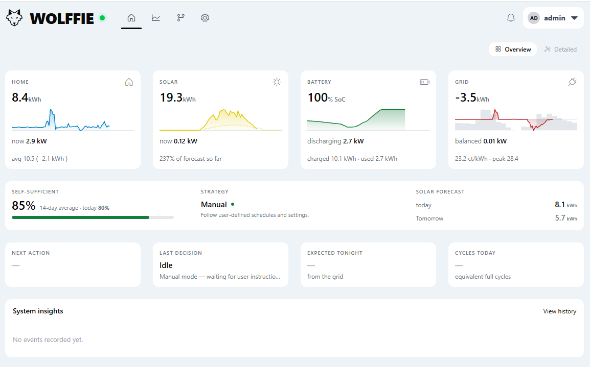

# Wolffie - your Home Energy Management System

## Project Overview

Wolffie is a modular, self-hosted energy monitoring and management platform designed for residential solar and battery systems. 
https://wolffieenergy.nl
It is created to enable management of your battery inverter and solar converter in 1 system and not to depend on public/external applications and API's from vendors.
It collects, stores, and visualizes real-time and historical energy data from multiple sources - currently including AlphaESS solar/battery inverters, HomeWizard smart devices, and SolarEdge systems — through a modern web interface. 
The system is built for extensibility, allowing new energy sources to be integrated as modular plug-ins without changing the core application. Connect your EV-charger, your Windturbine, your Boiler...



---

## Architecture

### Backend - Node.js + Express

The server-side application is built on **Node.js with Express** and is responsible for data collection, API endpoints, real-time communication, and system orchestration.

**Core services:**

- **Data Collector** (`dataCollector.js`) - Central orchestrator that manages data acquisition from all configured sources. It implements automatic failover logic: Cloud API is the primary source, with ModBus TCP/RTU as a local fallback. Snapshots are collected every 10–60 seconds depending on the active source and stored in MariaDB.
- **WebSocket Server** (`websocket.js`) - Provides real-time push updates to connected frontend clients. Broadcasts power data, connection status changes, and source-switch notifications so dashboards update instantly.
- **Scheduler** (`scheduler.js`) - Manages timed tasks including periodic data collection, minute/hourly aggregation, and daily summary generation at 00:05.
- **Database Service** (`database.js`) - Handles all MariaDB interactions including snapshot storage, multi-tier aggregation, event logging, and dispatch history tracking.
- **System Architecture Service** (`systemArchitectureService.js`) - Reads the component hierarchy and energy flow definitions from the database, enabling a fully dynamic system diagram on the frontend.
- **Settings Service** (`settingsService.js`) - Database-driven configuration management with change history and live reload capability.

### Frontend — Vue.js 3

The single-page application is built with **Vue.js 3**, **Pinia** for state management, **PrimeVue** for UI components, and **Chart.js** for data visualization.

**Key pages and components:**

- **Dashboard** (`Dashboard.vue`) - Live overview with real-time power flow, battery SOC, solar generation, grid import/export, and home consumption.
- **Dynamic System Diagram** (`DynamicSystemDiagram.vue`) - Renders the energy system topology directly from the database-defined architecture, showing components, sub-components, and animated power flows.
- **History** (`History.vue`) - Interactive charts for historical energy data with smart granularity selection (15-minute intervals for daily views, hourly for weekly, daily for monthly).
- **Analytics** (`Analytics.vue`) - Deeper energy analysis and performance metrics.
- **Control** (`Control.vue`) - Manual dispatch operations such as grid charging and discharging (requires ModBus connection).
- **Settings** (`Settings.vue`) - System configuration UI with live Cloud API and ModBus connection testing.
- **Setup Wizard** (`SetupWizard.vue`) - Guided initial configuration flow.

### Communication Protocols

| Protocol | Purpose | Notes |
|---|---|---|
| **AlphaESS Cloud API** | Primary data source for real-time and historical inverter data | Rate-limited; 60s polling interval |
| **ModBus TCP/RTU** | Local inverter communication; required for control operations | Lower latency; 10s polling |
| **RS485 Serial** | Planned direct inverter connection via USB-RS485 cable | DSD TECH adapter |
| **HomeWizard Local API** | Smart socket and P1 meter monitoring | LAN-based discovery |
| **HTTP REST** | Frontend ↔ Backend communication for config and historical data | Express routes |
| **WebSocket** | Real-time data push to frontend clients | Auto-reconnect with 5s retry |

---

## Database Design

The system uses **MariaDB/MySQL** with a multi-tier time-series storage strategy optimized for both real-time performance and long-term analysis.

### Data Tables

| Table | Granularity | Retention | Purpose |
|---|---|---|---|
| `energy_snapshots` | 10–60 seconds | 7 days | Raw real-time measurements |
| `energy_minutes` | 1 minute | Weeks | First-level aggregation with min/max/avg |
| `energy_hours` | 1 hour | Months | Energy totals (Wh) for charting |
| `energy_daily` | 1 day | Indefinite | Daily KPIs including self-consumption and self-sufficiency rates |

### Supporting Tables

- `system_components` — Hierarchical component definitions (locations → groups → devices) with specs and data source mappings.
- `component_flows` — Defines energy flow relationships and directions between components for the dynamic diagram.
- `system_events` — Timestamped event log with severity levels.
- `dispatch_history` — Records of manual and automated charge/discharge operations.
- `system_settings` — All configuration stored in the database with change tracking.

### Aggregation Pipeline

Snapshots are collected continuously and aggregated through an automated pipeline:

1. **Every minute** - Raw snapshots → `energy_minutes` (averages, min/max)
2. **Every hour** - Minute data → `energy_hours` (energy in Wh, import/export separation)
3. **Daily at 00:05** - Hourly data → `energy_daily` (kWh totals, self-consumption rate, self-sufficiency rate, peak power)
4. **After daily aggregation** - Snapshots older than 7 days are purged

This pre-aggregation approach delivers 5–10× query performance improvements over on-the-fly calculations.

---

## Data Collection & Failover

The data collector implements a resilient multi-source strategy:

```
Primary: AlphaESS Cloud API (reliable, rate-limited)
    ↓ on failure
Fallback: ModBus TCP/RTU (local, low-latency)
    ↓ on failure
Graceful degradation: cached data / historical display
```

Key behaviors:
- Source switches are logged and broadcast to frontend clients in real-time.
- ModBus connection loss never blocks the application — the system continues operating with Cloud API data.
- Control operations (charge/discharge) require an active ModBus connection since the Cloud API is read-only.
- Connection status is continuously monitored and reported to the UI.

---

## Modular Design

Each energy source is implemented as a self-contained module following a standardized structure:

```
modules/
  alphaess/
    manifest.json        # Module metadata and capabilities
    services/
      api.js             # External API communication
      collector.js       # Data collection logic
    routes/              # Express API endpoints
    config-schema.json   # Configuration definition
  homewizard/
    ...
  solar-forecast/
    ...
  electricity-pricing/
    ...
```

The **Collector Manager** discovers and loads modules at startup, orchestrating collection intervals and error handling uniformly across all sources.

---

## Key Design Principles

1. **Cloud-first, local-enhanced** - Cloud API provides reliable baseline data; local protocols add detail and control capabilities.
2. **Database-driven configuration** - UI layouts, system topology, and settings are all stored in the database rather than hardcoded, enabling diverse system architectures without code changes.
3. **Graceful degradation** - The system remains functional even when individual data sources are unavailable.
4. **Separation of concerns** - API communication lives in dedicated service files; collectors consume those services rather than making direct external calls.
5. **Pre-aggregated analytics** - Multi-tier aggregation ensures fast historical queries at any time scale.

---

## Technology Stack

| Layer | Technology |
|---|---|
| Frontend framework | Vue.js 3 + Vite |
| State management | Pinia |
| UI components | PrimeVue |
| Charts | Chart.js |
| Backend runtime | Node.js |
| Web framework | Express |
| Database | SQLite |
| Real-time | WebSocket (native) |
| ModBus | modbus-serial library |
| Authentication | JWT + refresh tokens |
| Dev environment | Windows |

### External Integrations

- **AlphaESS Cloud API** — Inverter and battery data
- **HomeWizard Local API** — Smart sockets and P1 meters
- **Forecast.Solar** — Solar production forecasting
- **Fraunhofer ISE Energy Charts** — Day-ahead electricity pricing

---

## Current Status & Roadmap

### Working

- AlphaESS Cloud API integration with real-time and historical data
- AlphaESS Modbus TCP local-connection
- AlphaESS RS485 serial communication (USB-RS485 cable)
- Live dashboard with WebSocket-powered updates
- Dynamic system diagram rendered from database architecture
- Historical data visualization with smart granularity
- Multi-tier data aggregation pipeline
- JWT authentication with role-based access
- Settings management with database persistence and live reload
- Solar forecast and electricity pricing modules
- HomeWizard Energy module (energy-socket devices manually added, based on api v1)
- SolarEdge integration
- Universal UI component system (dynamic rendering from backend schemas)

### In Progress

- HomeWizard Energy module (device discovery, P1 meter, smart sockets)
- A strategy module that determines when or if to charge from grid (low-prices) based on morning usage. Combined with the expected Solar production for next day.(hence solar-forecast)

### Planned

- Data retention policy automation
- Multi-building / multi-location support
- VLAN-isolated ModBus security hardening
- Long-term database optimization

---

*Wolffie — Manage your energy offline.*
